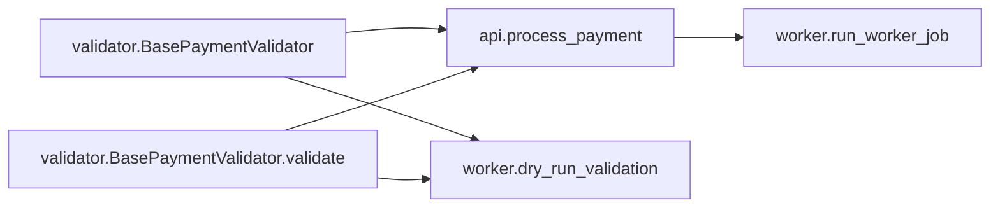

# Impact Tracer Report

## 1) Quick Result

- Overall risk: **HIGH** (`0.61`)
- Confidence: **HIGH**
- Files changed: `1`
- Changed symbols: `2`
- Affected symbols: `3`

## 2) What Changed

- `validator.BasePaymentValidator` (SIGNATURE_CHANGE)
- `validator.BasePaymentValidator.validate` (SIGNATURE_CHANGE)

## 3) What Might Break (Ranked)

- **HIGH** `api.process_payment` — score `0.61`, depth `1`
- **HIGH** `worker.dry_run_validation` — score `0.60`, depth `1`
- **MEDIUM** `worker.run_worker_job` — score `0.57`, depth `2`

## 4) Visual Graph

Interactive graph: [graph.html](graph.html)

The Mermaid diagram below is a quick visual summary. Use the interactive graph link for zoom, pan, and node details.

## 5) Plain-English Explanation

No LLM explanation available for this run.
