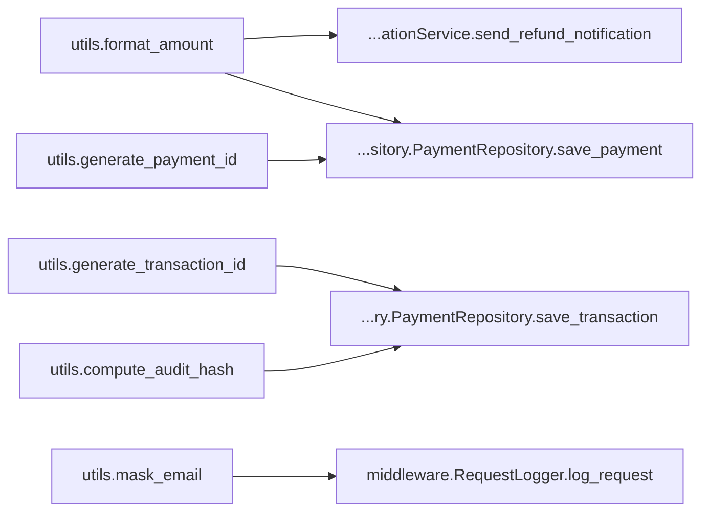

# Impact Tracer Report

## 1) Quick Result

- Overall risk: **HIGH** (`0.61`)
- Confidence: **HIGH**
- Files changed: `5`
- Changed symbols: `26`
- Affected symbols: `4`

## 2) What Changed

- `api.process_payment` (BODY_CHANGE)
- `api.create_payment` (SIGNATURE_CHANGE)
- `api.get_payment` (SIGNATURE_CHANGE)
- `api.process_refund` (SIGNATURE_CHANGE)
- `api._assess_risk` (SIGNATURE_CHANGE)
- `utils.format_amount` (BODY_CHANGE)
- `utils.generate_payment_id` (SIGNATURE_CHANGE)
- `utils.generate_transaction_id` (SIGNATURE_CHANGE)
- `utils.compute_audit_hash` (SIGNATURE_CHANGE)
- `utils.retry_with_backoff` (SIGNATURE_CHANGE)
- `utils.mask_email` (SIGNATURE_CHANGE)
- `validator.BasePaymentValidator` (SIGNATURE_CHANGE)
- `validator.BasePaymentValidator.__init__` (SIGNATURE_CHANGE)
- `validator.BasePaymentValidator.validate` (SIGNATURE_CHANGE)
- `validator.BasePaymentValidator.validate_amount` (SIGNATURE_CHANGE)
- `validator.BasePaymentValidator.validate_currency` (SIGNATURE_CHANGE)
- `validator.PaymentRequestValidator` (SIGNATURE_CHANGE)
- `validator.PaymentRequestValidator.validate_request` (SIGNATURE_CHANGE)
- `validator.RefundValidator` (SIGNATURE_CHANGE)
- `validator.RefundValidator.validate_refund` (SIGNATURE_CHANGE)
- `worker.run_worker_job` (BODY_CHANGE)
- `worker.dry_run_validation` (SIGNATURE_CHANGE)
- `worker.batch_validate_payments` (SIGNATURE_CHANGE)
- `worker.process_payment_with_retry` (SIGNATURE_CHANGE)
- `worker.process_pending_payments` (SIGNATURE_CHANGE)
- `worker.send_batch_notifications` (SIGNATURE_CHANGE)

## 3) What Might Break (Ranked)

- **HIGH** `middleware.RequestLogger.log_request` — score `0.61`, depth `1`
- **HIGH** `notification.NotificationService.send_refund_notification` — score `0.61`, depth `1`
- **HIGH** `repository.PaymentRepository.save_payment` — score `0.61`, depth `1`
- **HIGH** `repository.PaymentRepository.save_transaction` — score `0.61`, depth `1`

## 4) Visual Graph

Interactive graph: [graph.html](graph.html)

The Mermaid diagram below is a quick visual summary. Use the interactive graph link for zoom, pan, and node details.

## 5) Plain-English Explanation

**Summary**

The changes to several API functions and utility methods introduce a high risk of impact on downstream dependencies, particularly in payment processing and validation. Immediate attention is required to assess the effects on related services.

**Blast Radius**

The modifications affect core payment APIs and utility functions, which are critical for transaction handling. Downstream services relying on these APIs may experience failures or unexpected behavior due to the changes.

**Impacted APIs**
- api.process_payment
- api.create_payment
- api.get_payment
- api.process_refund
- api._assess_risk

**Impacted Modules/Functions**
- api
- utils
- validator
- worker

**Downstream Dependencies**
- middleware.RequestLogger.log_request
- notification.NotificationService.send_refund_notification
- repository.PaymentRepository.save_payment
- repository.PaymentRepository.save_transaction

**Known Impact Zones**
- Payment processing workflows that utilize the modified APIs.
- Utilities that format and generate payment-related data.

**Unknown Impact Zones**
- The full extent of impact on external services that consume these APIs is unknown.
- Potential side effects in the worker module due to changes in utility functions.

**High-Risk/Uncertain Areas**
- Changes in API signatures may lead to integration issues with clients relying on the previous versions.
- The impact of changes in validation logic on payment processing is uncertain.

**Top Risks**
- `middleware.RequestLogger.log_request`: Dependent on utils.mask_email, which has changed.
- `notification.NotificationService.send_refund_notification`: Relies on utils.format_amount, which has changed.
- `repository.PaymentRepository.save_payment`: Affected by changes in utils.format_amount.
- `repository.PaymentRepository.save_transaction`: Dependent on utils.generate_transaction_id, which has changed.

**Recommended Actions**
- Conduct thorough testing of all impacted APIs and downstream services.
- Review and update client integrations to accommodate signature changes.
- Monitor logs for errors related to the affected symbols post-deployment.
