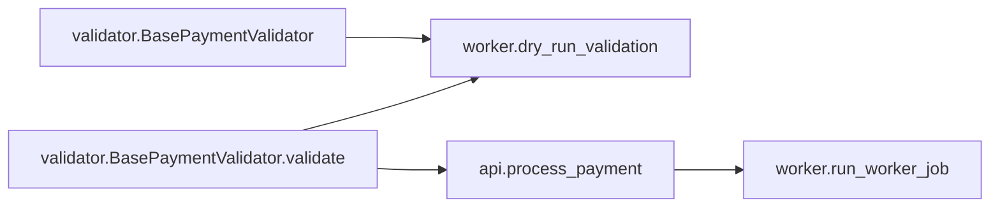

# Impact Tracer Report

## 1) Quick Result

- Overall risk: **HIGH** (`0.61`)
- Confidence: **HIGH**
- Files changed: `1`
- Changed symbols: `2`
- Affected symbols: `3`

## 2) What Changed

- `validator.BasePaymentValidator` (SIGNATURE_CHANGE)
- `validator.BasePaymentValidator.validate` (SIGNATURE_CHANGE)

## 3) What Might Break (Ranked)

- **HIGH** `api.process_payment` — score `0.61`, depth `1`
- **HIGH** `worker.dry_run_validation` — score `0.60`, depth `1`
- **MEDIUM** `worker.run_worker_job` — score `0.57`, depth `2`

## 4) Visual Graph

Interactive graph: [graph.html](graph.html)

The Mermaid diagram below is a quick visual summary. Use the interactive graph link for zoom, pan, and node details.

## 5) Plain-English Explanation

**Summary**

The changes to the signatures of `validator.BasePaymentValidator` and its method `validate` introduce a high risk of impact on dependent components. This could lead to potential failures in payment processing and validation workflows.

**Blast Radius**

The affected components include `api.process_payment`, which directly relies on the `validate` method, and `worker.dry_run_validation`, which depends on the `BasePaymentValidator`. Additionally, `worker.run_worker_job` is indirectly affected through its dependency on `api.process_payment`, increasing the risk of cascading failures.

**Top Risks**
- `api.process_payment`: Directly depends on the changed validate method.
- `worker.dry_run_validation`: Directly depends on the changed BasePaymentValidator.
- `worker.run_worker_job`: Indirectly affected through api.process_payment.

**Recommended Actions**
- Review and update all dependent methods to align with the new signatures.
- Conduct thorough testing of payment processing workflows.
- Implement fallback mechanisms to handle potential validation failures.
